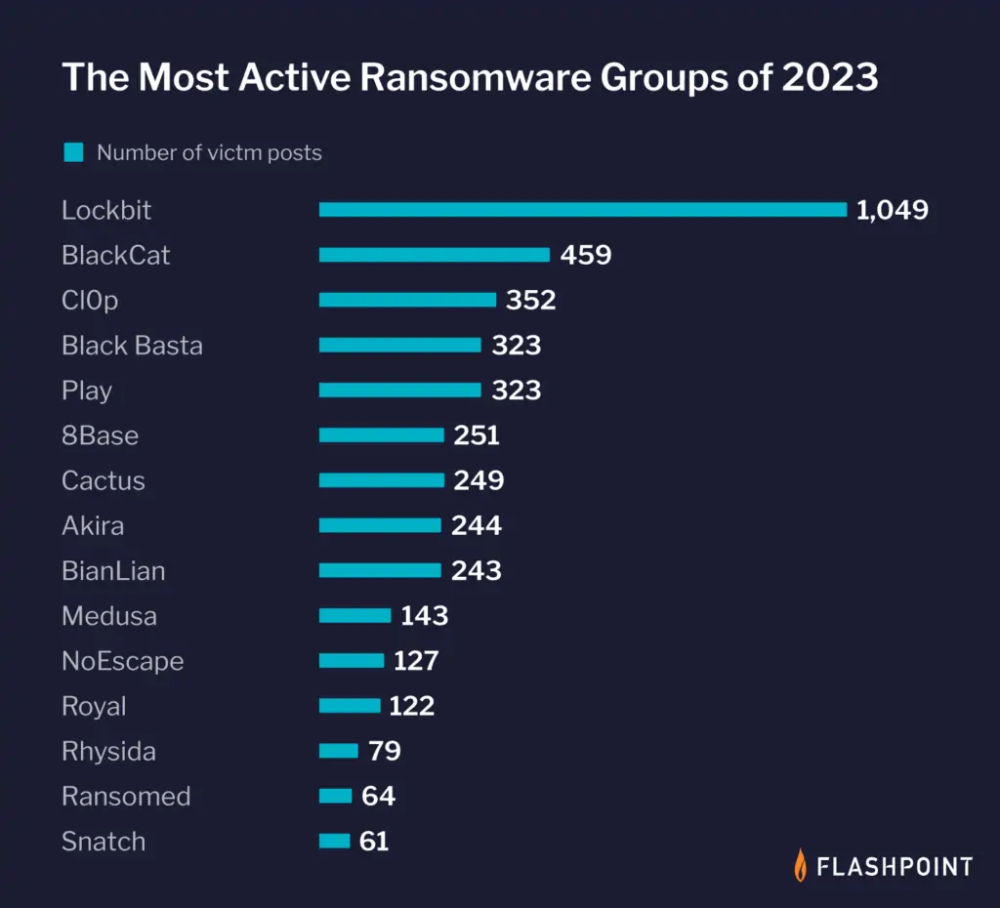

# LockBit-style Ransomware Simulation for NERRF

This document defines a controlled LockBit-style simulation for NERRF M0. The goal is to produce file-level write/open syscalls and realistic encryption behavior `(throttled to ~1 MB/sec)` within a single Kubernetes pod so our dependency graph and undo planner can be validated.

- **Scope**: single Minikube pod, `/app/uploads` only.

- **Acceptance**: Decrypt (undo) must restore files or produce evidence NERRF can plan reversal within `MTTR < 60 min` and `data loss < 128 MB`.

## LockBit TTPs

LockBit is a **Ransomware-as-a-Service (RaaS)** platform active since mid-2019, operated by the **GOLD MYSTIC** group. According to a joint statement by various government agencies, LockBit was the world's most prolific ransomware in 2022. It was estimated in early 2023 to be responsible for `44% of all ransomware` incidents globally. In the United States between January 2020 and May 2023, LockBit was used in approximately `1,700 ransomware attacks`, with $91 million paid in ransom to hackers.

It gains initial access to computer systems using purchased access, unpatched vulnerabilities, insider access, and zero-day exploits, in the same way as other malware. LockBit then takes control of the infected system, collects network information, and steals and encrypts data. Demands are then made for the victim to pay a ransom for their data to be decrypted so that it is again available, and for the perpetrators to delete their copy, with the threat of otherwise making the data public.

### Techniques and tactics

LockBit operators frequently gain initial access by exploiting vulnerable Remote Desktop Protocol (RDP) servers or compromised credentials purchased from affiliates. Initial access vectors also include phishing emails with malicious attachments or links, brute-forcing weak RDP or VPN passwords, and exploiting vulnerabilities such as `CVE-2018-13379` in Fortinet VPNs.

Once installed, LockBit ransomware is often executed in Microsoft Windows via command-line arguments, scheduled tasks, or PowerShell scripts such as PowerShell Empire. LockBit uses tools such as Mimikatz, GMER, Process Hacker, and registry edits to gather credentials, disable security products, and evade defenses. It enumerates network connections to identify high-value targets such as domain controllers using scanners such as Advanced Port Scanner.

For lateral movement, LockBit spreads through SMB file-sharing connections inside networks, using credentials gathered earlier. Other lateral movement techniques include distributing itself via compromised Group Policy objects, or using tools such as PsExec or Cobalt Strike.

LockBit's ransomware payload encrypts files and network shares using AES and RSA encryption. It encrypts only the first few kilobytes of each file for faster processing, and adds a ".lockbit" extension. LockBit then replaces the desktop wallpaper with a ransom note; it can also print ransom notes to attached printers. The goal is to extort payment of a ransom to reverse system disruption and restore file access.

### LockBit Variant Comparison Table

| **Variant**           | **First Seen** | **Key Features / TTPs**                                                                                                                                                                                                     | **Platform**             | **Notable Tools / Mechanisms**                        |
| --------------------- | -------------- | --------------------------------------------------------------------------------------------------------------------------------------------------------------------------------------------------------------------------- | ------------------------ | ----------------------------------------------------- |
| **LockBit (v1)**      | Mid-2019       | • `.abcd` → `.lockbit` extension switch  • Encryption in < 5 min  • Auto-spread via PowerShell & PSExec                                                                                                               | Windows                  | PowerShell, PSExec                                    |
| **LockBit 2.0**       | July 2021      | • Faster string decoding (evasion)  • Auto-encrypts Windows domains via AD GPOs  • Disables Microsoft Defender  • “StealBit” for targeted file exfiltration  • Linux/ESXi sub-variant (“Linux-ESXI Locker 1.0”) | Windows + Linux + ESXi   | StealBit, AD GPO abuse                                |
| **LockBit 3.0**       | June 2022      | • Anti-analysis & password-only execution  • Command-line augmentation  • **Bug bounty program** ($1 k – $1 M)  • Continued speed improvements                                                                     | Windows + Linux + ESXi   | Bug bounty categories: Locker bugs, Tor, Tox, website |
| **LockBit Green**     | Jan 2023       | • High code reuse from Conti  • Same CLI options as Conti  • Targets Windows environments                                                                                                                             | Windows                  | Conti-derived code                                    |
| **LockBit for macOS** | May 2023       | • Mach-O binary (ELF recompile)  • Commands incompatible with macOS  • Version 1.2 “Linux/ESXi locker” base  • **Currently non-functional** – proof-of-concept only                                                | macOS (proof-of-concept) | N/A (non-functional)                                  |

## References

1. [TrendMicro - Rising Threat from LockBit](https://www.trendmicro.com/content/dam/trendmicro/global/en/research/24/b/lockbit-attempts-to-stay-afloat-with-a-new-version/technical-appendix-lockbit-ng-dev-analysis.pdf)
2. [Logpoint Emerging Threats Report – LockBit TTPs](https://www.logpoint.com/wp-content/uploads/2023/07/etp-lockbit.pdf)
3. [Vectra AI – LockBit TTP Map](https://www.vectra.ai/modern-attack/threat-actors/lockbit)
4. [CISA - Understanding Ransomware Threat Actors: LockBit](https://www.cisa.gov/news-events/cybersecurity-advisories/aa23-165a)
5. [CISA & FBI - #StopRansomware: LockBit 3.0](https://www.cisa.gov/news-events/cybersecurity-advisories/aa23-075a)
6. [FBI - Ransomware Investigation](https://www.fbi.gov/investigate/violent-crime/cac/ransomware)
7. [Mandiant - LockBit Ransomware Analysis](https://www.mandiant.com/resources/blog/lockbit-ransomware-analysis)

## Phases (simulated)

1. Initial access: `kubectl exec` (simulated).
2. Encryption: stream-based AES-256 encryption of `/app/uploads` files at ~1 MB/s. Produces `.lockbit` files + `README_LOCKBIT.txt`.
3. Optional mock exfiltration to localhost.

## Simulation script (summary)

- `stream_encrypt.py` — reads each file in 1MB chunks, writes encrypted chunks, sleeps ~1s per chunk to simulate 1MB/s.
- Writes `.lockbit` and removes original file.
- Produces syscall patterns: `open`, `write`, `close`.

## Validation

- Deploy `k8s/encrypt-test.yaml` (Ubuntu pod with `emptyDir` volume).
- Create 128 MB of test files (`dd if=/dev/urandom ...`).
- Run encryptor and capture `strace -f -e trace=open,write,close -p <pid>`.
- Run decryptor and compare restored file sizes/hashes.

## Metrics

- Encryption rate observed (MB/sec).
- Number of tainted files (graph nodes): N.
- Time to recover using standard decrypt process. Target: MTTR < 60 minutes, data loss < 128 MB.

## Acceptance criteria

- Doc covers phases and expected syscalls.
- Manual validation demonstrates observable write/open syscalls to `/app/uploads`.
- Decryption (undo) restores files (or provides a reproducible recovery path).
